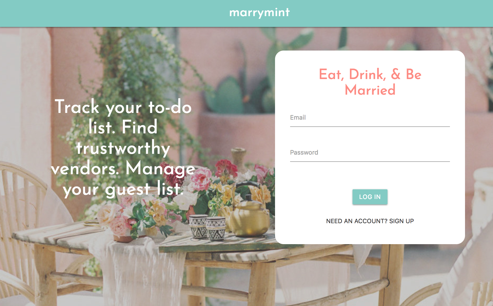

# Marrymint

A project management tool for brides and grooms planning their own wedding.

### About This Project

Wedding planning is supposed to be a fun and exciting time when soon-to-be brides and grooms get to celebrate with their friends and family. In reality, planning a wedding can be one of the most stressful things couples do together.

We created Marrymint as an online project management tool to help brides and grooms streamline the wedding planning process. After creating an account, users can:
* Manage a to-do list created by a wedding professional
* Track their guests' attendance as their RSVPs come in
* Search for trustworthy vendors from a curated list
* Add vendors they're interested in to their own page

### Technologies Used

HTML5, CSS3, Materialize CSS, Google Fonts, Javascript, jQuery, NodeJS, Express, React, MongoDB, Mongoose, JSON Web Token, User Authentication

### View The Project

Visit [this page](https://marrymint.herokuapp.com/) to start planning your wedding!

